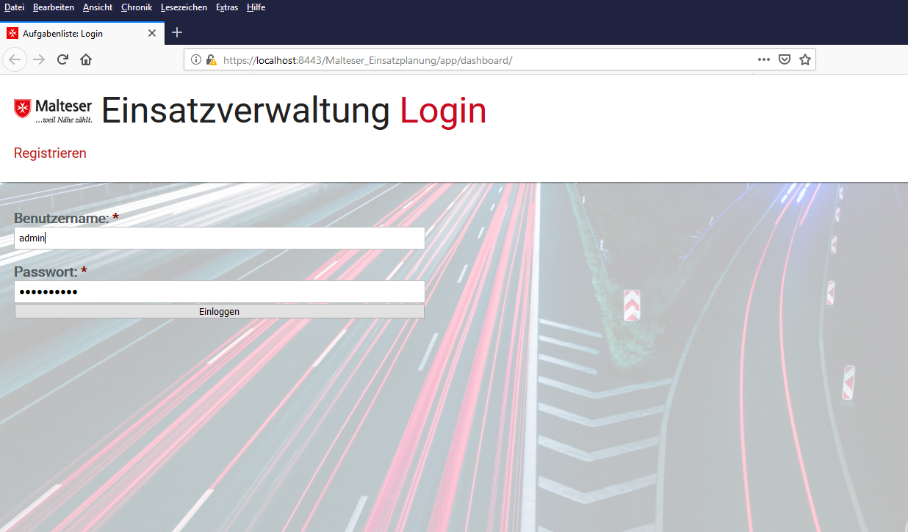

Anwendung Malteser_Einsatzplanung
=========================

Kurzbeschreibung
----------------

Dies ist ein Beispiel für eine in Java realisierte, serverseitige MVC-Webanwendung.
Die Anwendung setzt dabei ganz klassisch auf der „Jakarta Enterprise Edition”
(ehemals „Java Enterprise Edition“) auf und läuft daher in einem extra dafür
ausgelegten Applikationsserver. Sämtliche Anwendungslogik wird dabei vom Server
implementiert, so dass für jedes URL-Pattern der Anwendung ein komplett serverseitig
generierte HTML-Seite abgerufen und im Browser dargestellt wird.

Mithilfe der Anwendung soll die Möglichkeit geschaffen werden, Einsätze der Malteser anzulegen
und anschließend in verschiedene Kategorien einzuteilen. Die Kategorien können dabei selbst festgelegt
werden und sind jeweils in "Offen", "Im Einsatz", "Einsatz abgeschlossen", "Einsatz abgebrochen" oder
alle Stati zu filtern. Zusätzlich bietet die Anwendung eine Benutzerverwaltung mit den Funktionen
Registrierung, Einloggen, Benutzer verwalten und Ausloggen. Es wird ein SOAP-Webservice verwendet.

Verwendete Technologien
-----------------------

Die App nutzt Maven als Build-Werkzeug und zur Paketverwaltung. Auf diese Weise
werden die für Jakarta EE notwendigen APIs, darüber hinaus aber keine weiteren
Abhängigkeiten, in das Projekt eingebunden. Der Quellcode der Anwendung ist dabei
wie folgt strukturiert:

 * **Servlets** dienen als Controller-Schicht und empfangen sämtliche HTTP-Anfragen.
 * **Enterprise Java Beans** dienen als Model-Schicht und kapseln die fachliche Anwendungslogik.
 * **Persistence Entities** modellieren das Datenmodell und werden für sämtliche Datenbankzugriffe genutzt.
 * **Java Server Pages** sowie verschiedene statische Dateien bilden die View und generieren den
   auf dem Bildschirm angezeigten HTML-Code.

Folgende Entwicklungswerkzeuge kommen dabei zum Einsatz:

 * [NetBeans:](https://netbeans.apache.org/) Integrierte Entwicklungsumgebung für Java und andere Sprachen
 * [Maven:](https://maven.apache.org/) Build-Werkzeug und Verwaltung von Abhängigkeiten
 * [Git:](https://git-scm.com/") Versionsverwaltung zur gemeinsamen Arbeit am Quellcode
 * [TomEE:](https://tomee.apache.org/) Applikationsserver zum lokalen Testen der Anwendung
 * [Derby:](https://db.apache.org/derby/) In Java implementierte SQL-Datenbank zum Testen der Anwendung

Screenshots
-----------

<table style="max-width: 100%;">
    <tr>
        <td>
            
        </td>
        <td>
            
        </td>
    </tr>
    <tr>
        <td>
            Login
        </td>
        <td>
            Registrierung
        </td>
    </tr>
</table>

<table style="max-width: 100%;">
    <tr>
        <td>
            
        </td>
        <td>
            
        </td>
    </tr>
    <tr>
        <td>
            Dashboard
        </td>
        <td>
            Liste mit Einsätzen
        </td>
    </tr>
</table>

<table style="max-width: 100%;">
    <tr>
        <td>
            
        </td>
        <td>
            
        </td>
    </tr>
    <tr>
        <td>
            Einsatz bearbeiten
        </td>
        <td>
            Kategorien bearbeiten
        </td>
    </tr>
</table>

Copyright
---------

Dieses Projekt ist lizenziert unter
[_Creative Commons Namensnennung 4.0 International_](http://creativecommons.org/licenses/by/4.0/)

© 2019 Paula Sollner, Justin Hollmann, Jonas Beuth  
Github: https://github.com/jonasb007/Malteser_Einsatzplanung.git  
